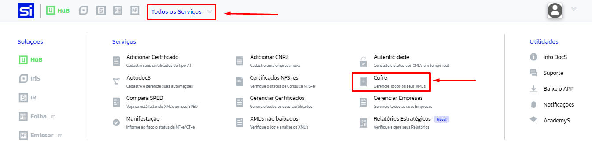
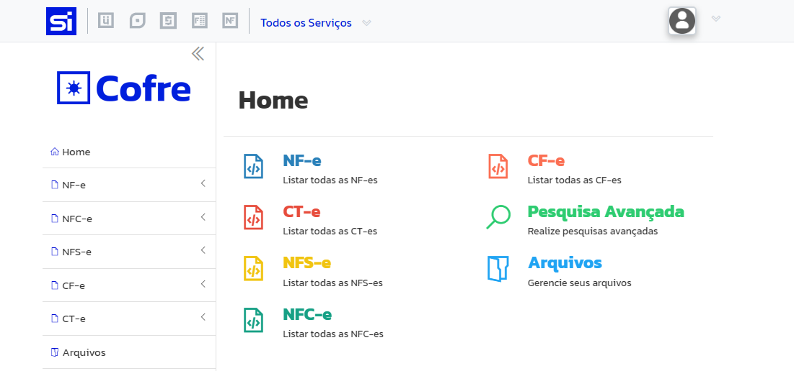
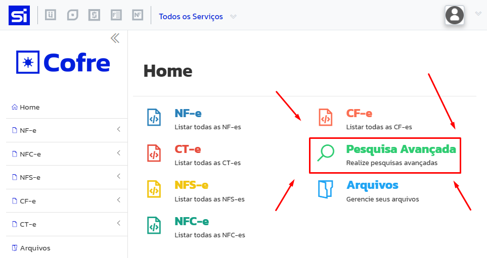
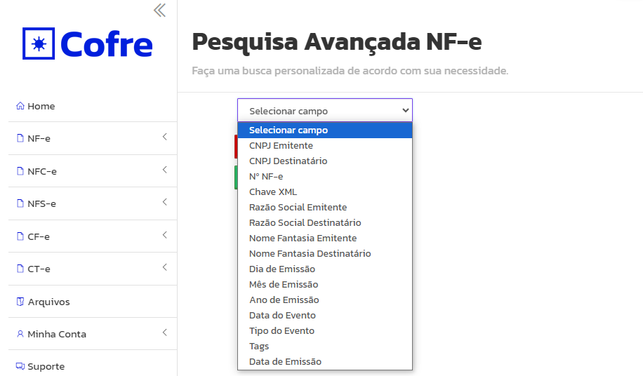
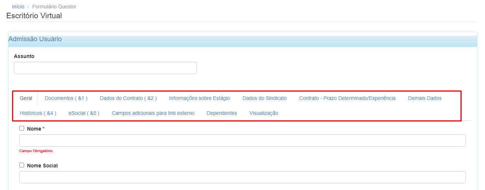
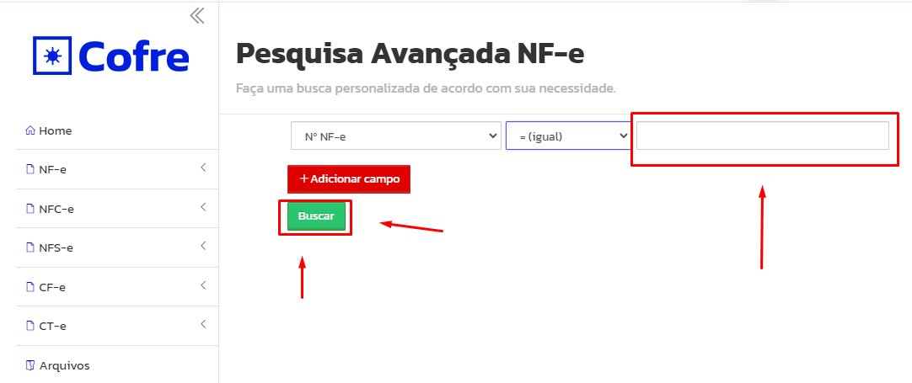
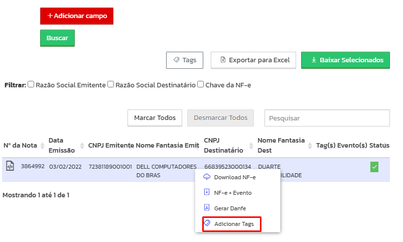
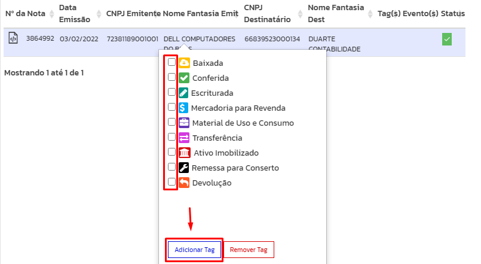
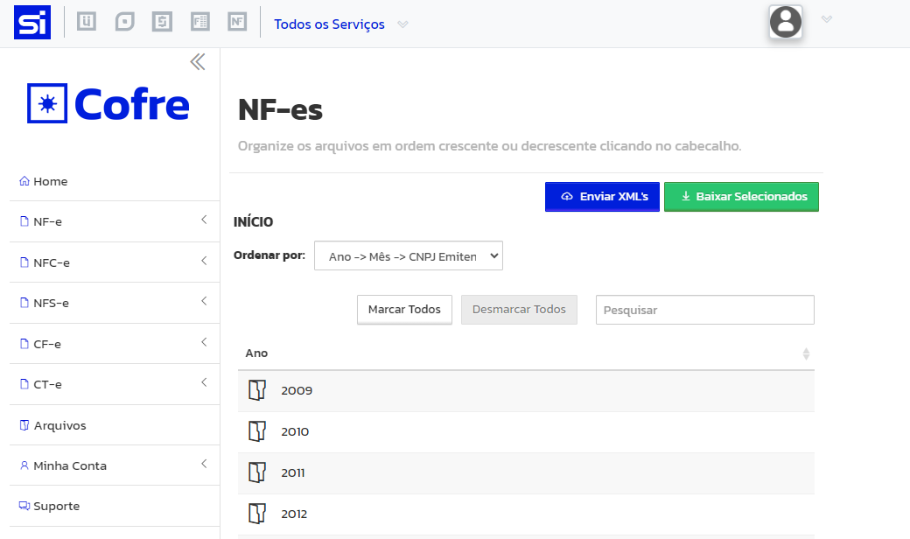
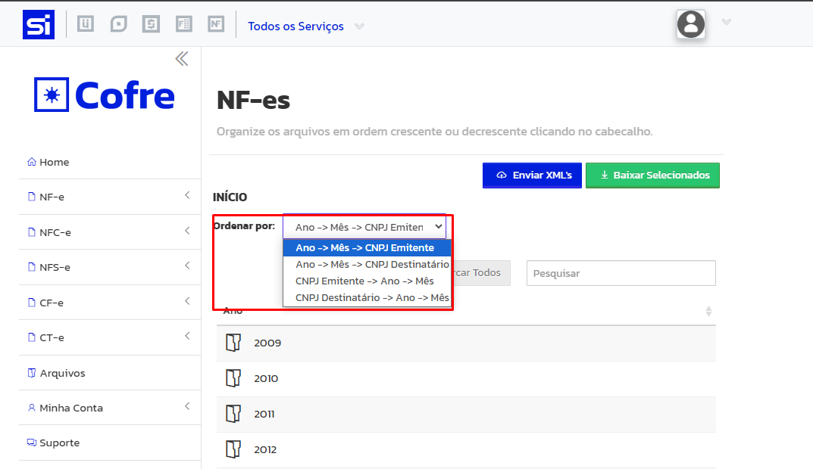

# Colocar Tag em Notas no Sieg

**Olá, nesse manual vamos aprender a colocar Tag em notas no SIEG**

## Acessando o Sieg

1 - Para acessar o SIEG, clique no link a seguir [SIEG](https://hub.sieg.com/){:target="_blank"}

2 - Após chegar na tela de login preencha com seus dados.

* **Caso não tenha suas informações de login entre em contato pelo [Whatsapp](https://wa.me/5519992062440){:target="_blank"} ou pelo telefone (19) 3406-3845**

3 - Ao preencher sera direcionado ao menu principal do SIEG.

### Conhecendo o ambiente

1 - No menu principal do Sieg, clique em "Todos os Serviços" e depois clique em "Cofre"

2 - Você será redirecionado para uma tela onde poderá procurar por suas notas.

### Pesquisa Avançada

1 - Clicando em "Pesquisa Avançada", você poderá pesquisar por uma nota especifica utilizando algum dos campos disponiveis.

2 - Para saber por quais campos você pode pesquisar, clique em "Selecionar Campo".

* **Veja os campos abaixo.**

3 - Selecione o campo desejado, caso seja necessario é possivel adicionar mais campos, basta clicar em "Adicionar Campo".

3.1 - Caso não deseje adicionar mais campos clique em "Selecionar" e coloque qual operador de comparação quer colocar 

4 - Após preencher coloque o valor que deseja procurar e clique em "Buscar".

5 - Após isso as notas, cujo o filtro se encaixa, serão listadas abaixo.

6 - Para adicionar uma tag a nota, clique com o botão direito do mouse, selecione "Adicionar Tags".

7 - Selecione a categoria que desejar e clique em "Adicionar Tag".

8 - Está feito!!! A nota esta com categoria.

### Menu NF-e

1 - Clicando em NF-e você será direcionado para uma tela com as notas das suas empresas separadas por ano.

* **É possível ordenar as notas de varias maneiras.**

2 - Agora voce poderá se guiar pelas pastas de acordo com o que deseja.

2.1 - Após selecionar uma pasta, você será direcionado para outra pasta para escolher o mes e depois para escolher o CNPJ com qual a nota esta relacionada.

2.2 - Após chegar a pasta final, as notas serão listadas.

3 - Para adicionar uma tag a nota, clique com o botão direito do mouse, selecione "Adicionar Tags".

4 - Selecione a categoria que desejar e clique em "Adicionar Tag".

5 - Está feito!!! A nota esta com categoria.