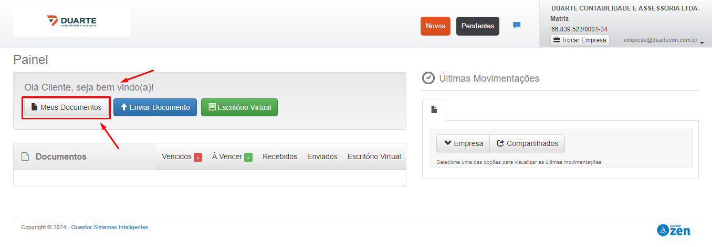
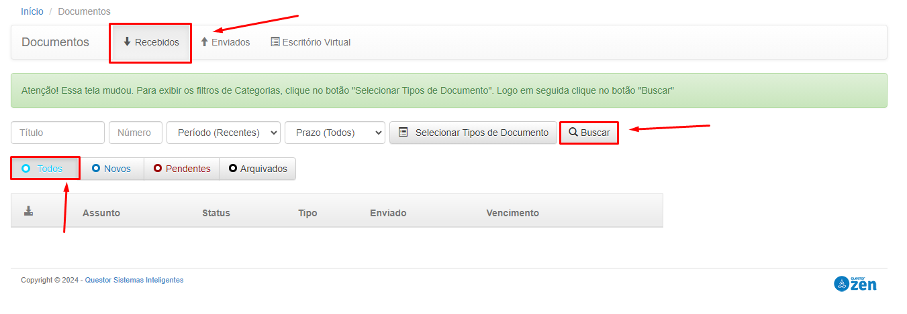
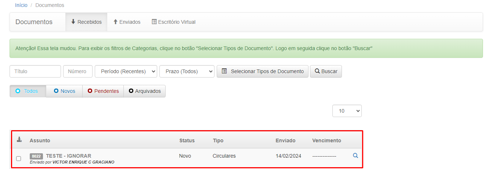
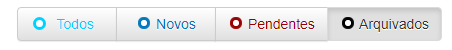
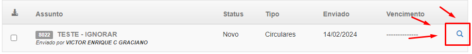
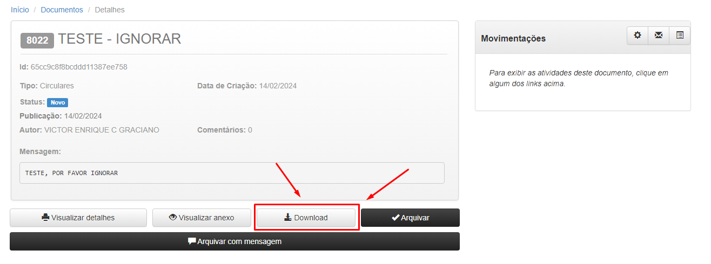
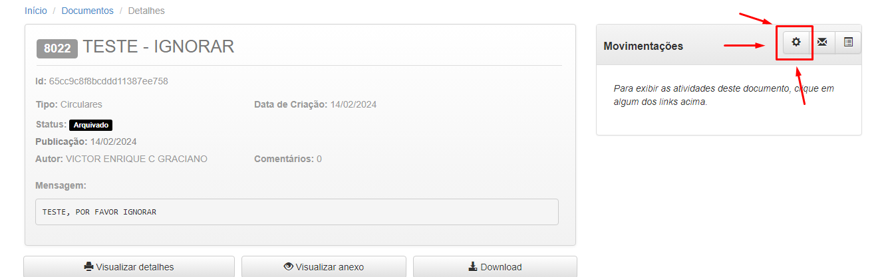
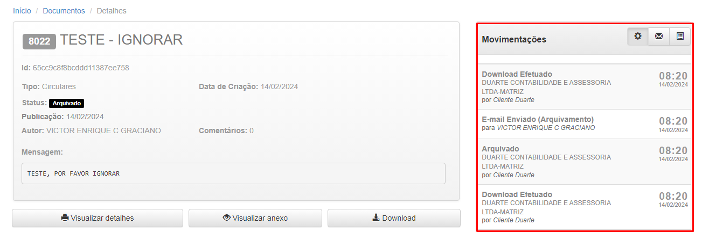

# Visualizando Documentos Recebidos

1 - Para visualizar os documentos que enviamos para você, clique em "Meus Documentos"

2 - Nessa etapa é necessario colocar os filtros para visualizar os documentos.

* Deixe a opção "Recebidos" selecionada

* Selecione a opção "Todos" 

* Clique em "Buscar"

3 - Fazendo esses passos todas as suas publicações recebidas (ja visualizadas e em aberto) serão listadas.

**Explicação dos status de documentos**

* NOVO: Publicação que você ainda precisa visualizar

* PENDENTE: Publicação que foi aberta, porem não fez download dos Arquivos

* ARQUIVADO: Publicação que ja foi aberta e ja foi feito o download dos arquivos

 4 - Para visualizar o documento clique na "Lupinha" na frente da publicação desejada.

 

 5 - Nessa tela é possivel ver algumas informações da publicação e para fazer o download dos arquivos cliquem em "Download" e assim os arquivos serão baixados no seu computador.

 

 * *Após fazer isso o status da publicação irá automaticamente para "Arquivado"*

 5.1 - Ainda na tela da publicação, temos a opção de visualizar o historico da publicação. Quem enviou, quem visualizou, quem recebeu a publicação, tudo isso com dia e horario que a atividade foi realizada. Para visualizar, clique na "Engrenagem ao lado de "Movimentações".

* *Após clicar poderá ver todas as movimentações*

6 - Não se esqueça de sempre abrir os documentos que você fez download e verificar sobre o que se trata.