# Acessando o ZEN

1 - Comece Abrindo seu e-mail

2 - Procure pelo e-mail com o assunto "Usuário do Cliente Cadastrado"

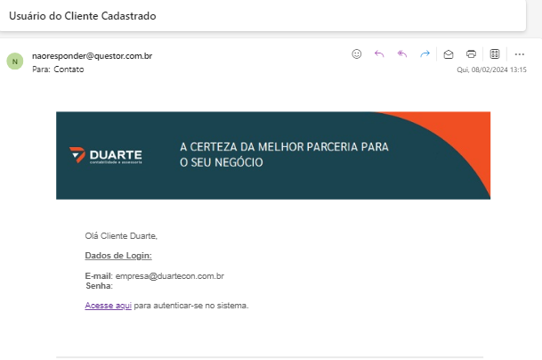

* *Nesse e-mail você terá acesso ao seu Login, senha e o Link do Portal*

3 - Acesso o Link [Portal ZEN](https://duarte.app.questorpublico.com.br/){:target="_blank"}

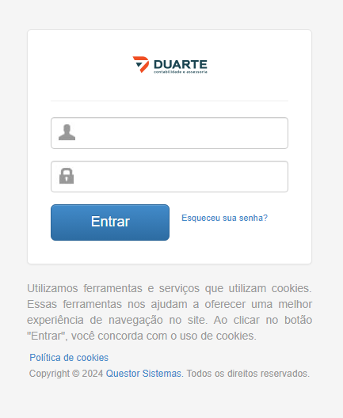

* *Clicando no Link voce chegará nessa tela*

4 - Preencha com o Login e senha do e-mail que acabamos de abrir e clique em "Entrar"

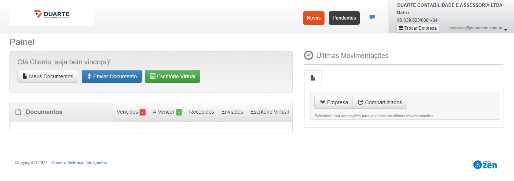

* *Chegamos no menu principaldo Portal ZEN*

5 - Verifique se a empresa que esta selecionada é a que você deseja utilizar no momento (apenas para clientes que possum mais de uma empresa ou filiais)

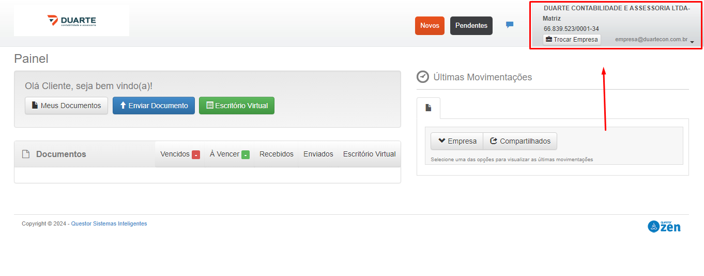

* *Você pode verificar se é a empresa certo pelo nome ou pelo CNPJ.*

6 - Caso deseje trocar de empresa Clique em "Trocar empresa" e selecione a correta.

## Enviar Documentos

1 - Clique em "Enviar Documentos"

2 - Será necessario que preencher 2 campos: Categoria e Documento.

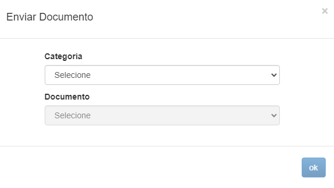

* *No campo de categoria você deverá escolher a opção de departamento que voce desejar. EX: Contabil, Pessoal, Fiscal.*

* *No campo de Documento você deverá escolher a opção de documento, de acordo com o departamento. EX: Extratos, Atestados, Notas Fiscais.*

3 - Após isso vocÊ será direcionado para uma tela e será necessario preencher as informações solicitadas e no final você poderá anexar seu documento. No final, se preencheu tudo corretamento, clique em "Cadastrar".

## Escritório Virtual

* Agora vamos conhecer todos os tipo de documentos e solicitações que você pode enviar pelo escritorio virtual.

1 - Clique em "Escritório Virtual".

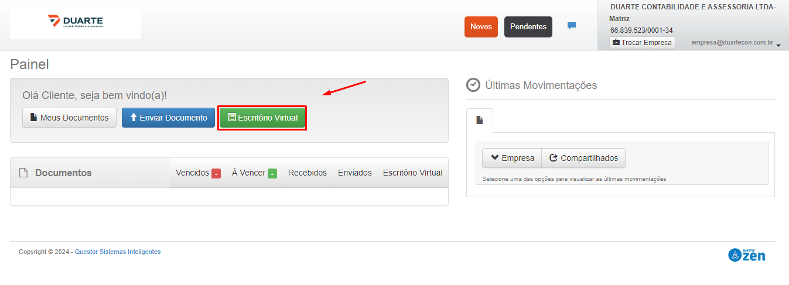

2 - Será necessario preencher 2 campos, Categoria e Documento.

* A Categoria só terá a opção folha de pagamento, deixe ela selecionada.

* Na area de documento teremos todas essas opções.

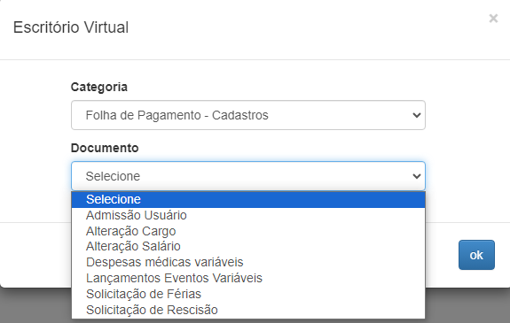

* **Abaixo segue manual de cada tipo de documento, se você não precisar enviar algum documento pode ignorar. Caso precise pode ir direto para o manual, selecionando pelo menu a esquerda.**

### Cadastro de Admissão de Usuário

1 - Você será direcionado para o formulário para preencher com as informações.

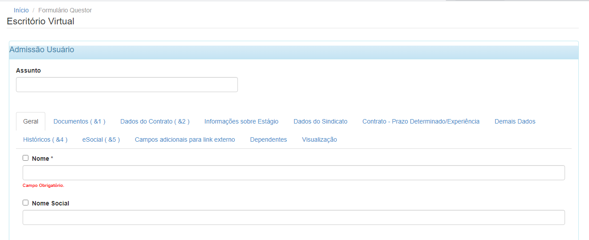

2 - Preencha o assunto com o nome do funcionário.

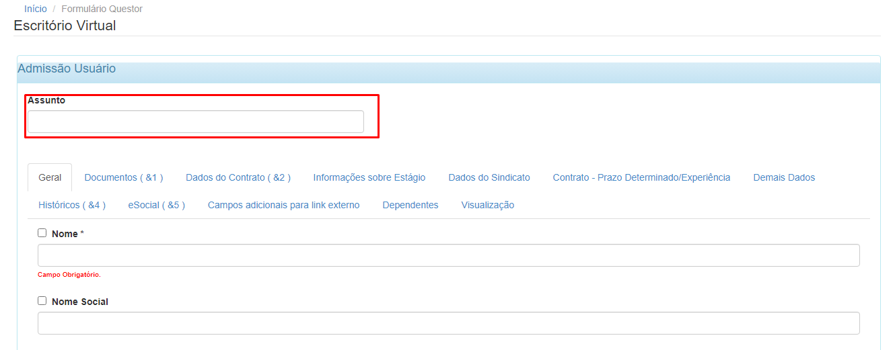

3 - A partir de agora é só preencher os campos solicitados com as informações do funcionário. Lembrando que tem varias abas, de Geral até Visualização e todas tem informações para serem preenchidas.

* *Fique atento os campos obrigatórios. se alguns desses campos estiverem vazios não é possível enviar a admissão.*

* *Para identificar esses campos é preciso olhar a baixo dele se esta escrito "Campo Obrigatório" ou ficar atento a campos com asteristico na frente.*

* *No final de cada pagina tera a opção "Proxima aba" para ir prosseguindo para as abas seguintes e finalizar o cadastro.*

4 - Alguns campos será necessario colocar um código inves de um texto, segue exemplo abaixo. Caso não saiba qual codigo colocar, clique na "Lupinha" que estará ao lado do campo de texto.

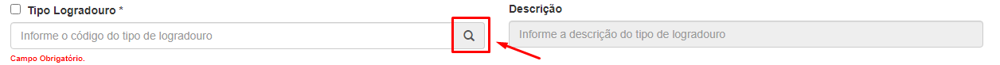

5 - Após clicar na lupa, irá abrir uma tela com as opções listadas. Lembre sempre de desmarcar a opção "Cadastros Especificos da Empresa" para conseguir visualizar mais opções.

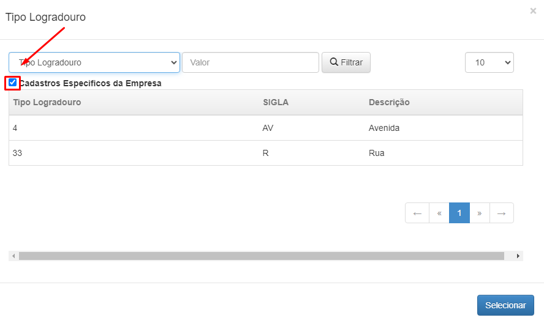

6 - Você tambem procurar um valor e selecionar em qual coluna quer pesquisar.

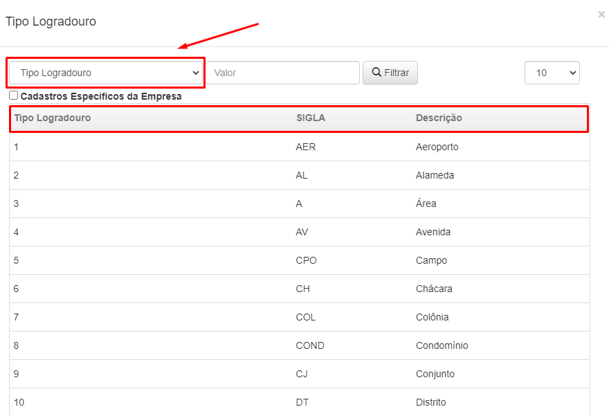

7 - Caso tenha alguma duvida com o que preencher em qualquer campo, entre em contato com o escritório para ser auxiliado.

8 - Após preencher todas as informações e chegar na ultima aba (Visualização), você poderá conferir tudo o que foi digitado e no final da pagina podera clicar em "Enviar para Sincronização" e caso não queira enviar no momento para apenas clicar em "Salvar Rascunho" e ficará salvo para finalizar em outro momento.

### Alteração de Cargo

1 - Para fazer alteração de cargo é necessario preencher apenas com as informações de nome do funcionário, data inicial do novo cargo, o novo cargo e o motivo.

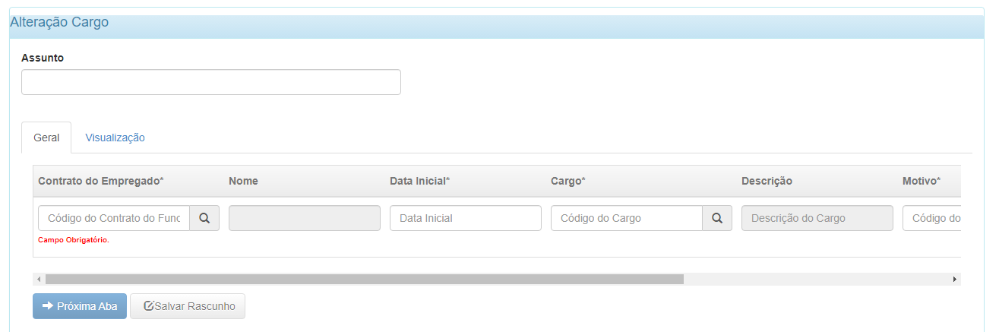

* *Os campos que tiver uma "Lupinha" na frente é necessario preencher com um codigo, para verificar qual codigo colocar, clique na lupinha e procure pelo valor desejado.*

2 - Após isso apenas confira as informações digitadas na proxima aba e clique em "Enviar".

### Alteração de Salário

1 - Para fazer alteração de salário é necessário preencher apenas os campos de nome do empregado, data inicial, motivo e o novo salario.

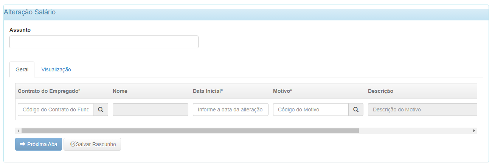

* *Os campos que tiver uma "Lupinha" na frente é necessario preencher com um codigo, para verificar qual codigo colocar, clique na lupinha e procure pelo valor desejado.*

2 - Após isso apenas confira as informações digitadas na proxima aba e clique em "Enviar".

### Despesas Médicas Variaveis

1 - Selecione a operadora Clicando na Lupinha e a competencia.

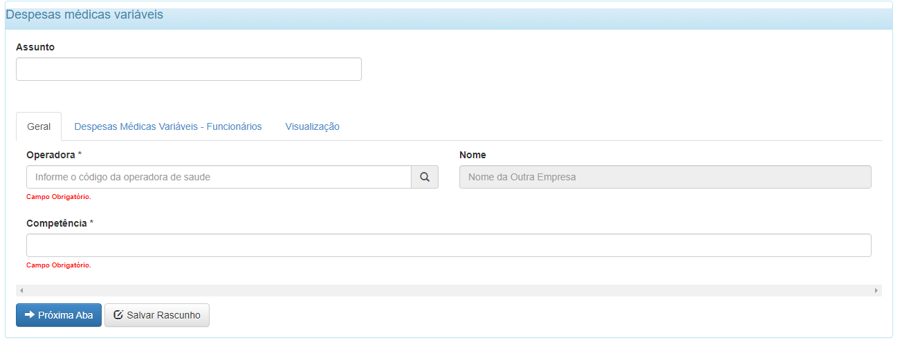

* *Operadora seria o lugar que sua empresa tem convenio.*

2 - Clique em "Próxima aba".

3 - Nessa etapa deverá ser preenchido com as informações do funcionario. Sempre informando os dependentes, se houver.

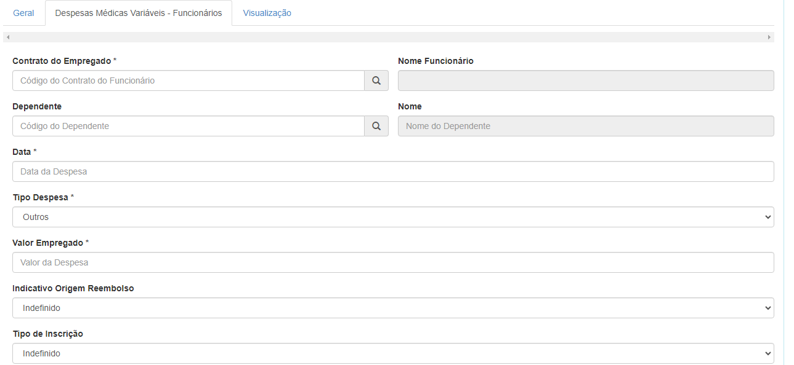

4 - Se houver varios funcionarios que tiveram essa despesa, preencha todas as informações e clique em "Adicionar", assim o funcionario anterior ficará salvo e você poderá cadastrar um funcionario novo.

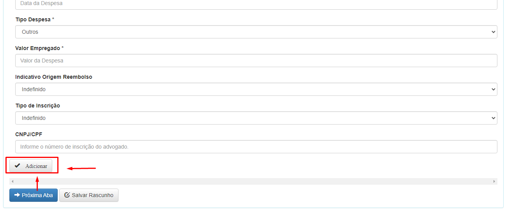

5 - Após digitar todos os funcionarios e dependentes Cliq em "Proxima aba", confira as informações e clique em "Enviar para Sincronização" ou "Salvar Rascunho" se deseja enviar em outro momento.

### Lançamentos de Eventos Variaveis

1 - Selecione os eventos que você deseja digitar (pode selecionar quantos desejar).

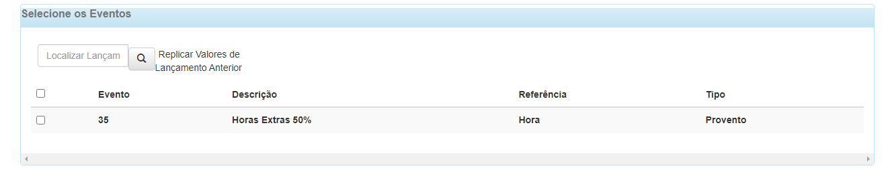

2 - Clique em "Proximo Passo".

3 - Digite o valor do evento para os funcionários que tiveram esse evento, caso o funcionario não tenha o evento, deixe em branco.

4 - Após digitar os eventos de todos os funcionarios clique em "Proxima Aba".

5 - Confira as informações e clique em "Enviar Para Sincronização" ou "Salvar Rascunho" se deseja enviar em outro momento.

* *Lembre de sempre digitar todos os eventos em apenas um envio, pois não é possivel enviar varias publicações com eventos diferentes, pois o sistema só considera o ultimo enviado.*

### Solicitação de Férias

1 - Preencha todos os campos com as informações que são solicitadas.

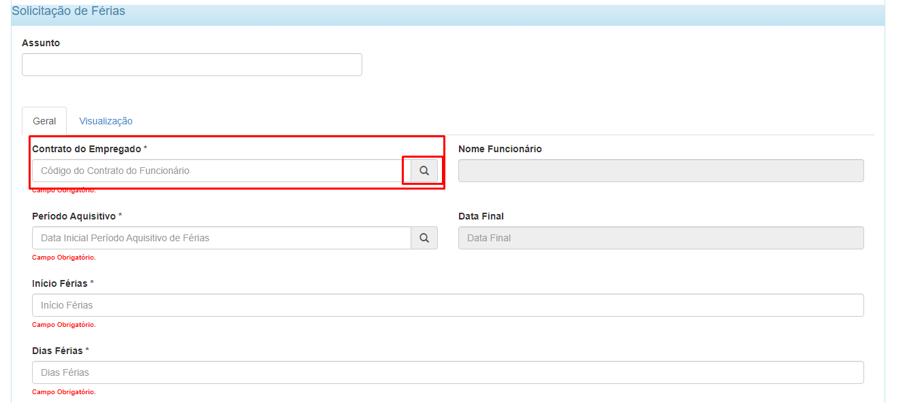

* Lembre-se que os campos com "lupinha" é necessario clicar na lupa e selecionar o valor desejado, sempre desmarcando a opção "Mostrar/ Ocultar Inativos".

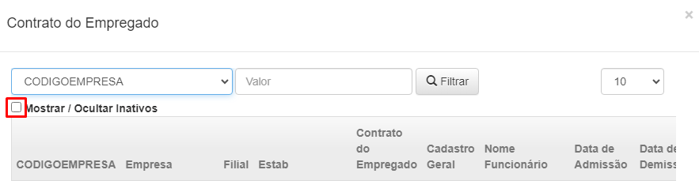

2 - Após tudo preenchido, clique em "Proxima Aba".

3 - Verifique as informações e clique em "Envia para Sincronização" ou "Salvar Rascunho" se deseja enviar em outro momento.

### Solicitação de Rescisão

1 - Preencha todos os campos com as informações que são solicitadas.

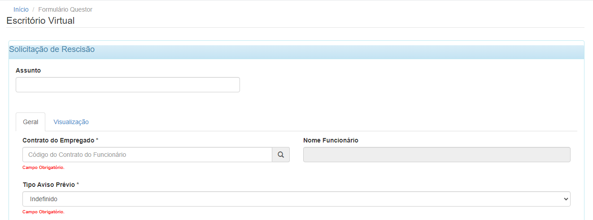

* Lembre-se que os campos com "lupinha" é necessario clicar na lupa e selecionar o valor desejado, sempre desmarcando a opção "Mostrar/ Ocultar Inativos".

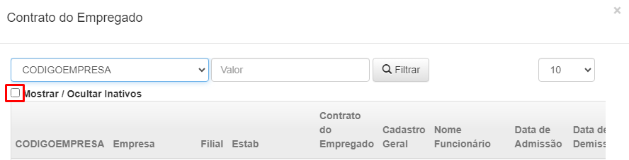

2 - Clique em "Proxima Aba".

3 - Confira as informações digitadas e clique em "Enviar para Sincronização" ou "Salvar Rascunho" se deseja enviar em outro momento.

## Visualizando Documentos Enviados

1 - Para consultar os documentos que você enviou para nós clique em "Meus Documentos"

2 - Nessa etapa é necessario colocar os filtros para visualizar os documentos.

* Deixe a opção "Enviados" selecionada

* Selecione a opção "Todos" 

* Clique em "Buscar"

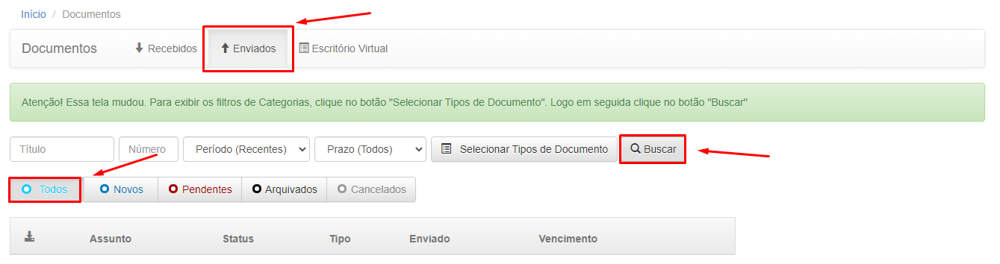

3 - Todas as seus documentos enviados serão listados

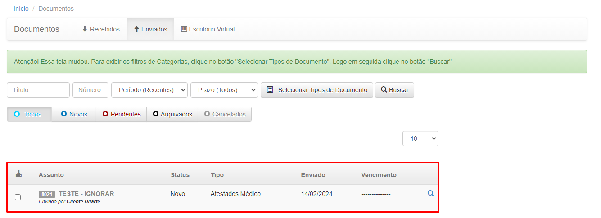

**Explicação dos status de documentos**

* NOVO: Publicação que você ainda precisa visualizar

* PENDENTE: Publicação que foi aberta, porem não fez download dos Arquivos

* ARQUIVADO: Publicação que ja foi aberta e ja foi feito o download dos arquivos

4 - Para consultar mais detalhes clique na "Lupinha"

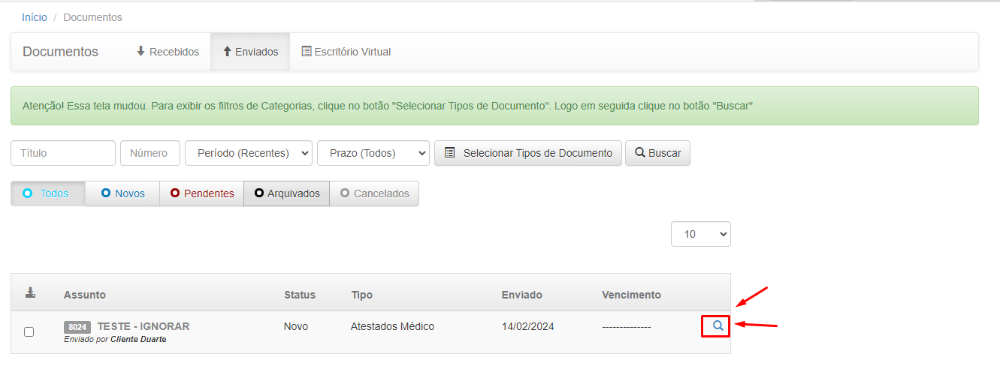

5 - Você poderá consultar o status, visualizar detalhes, visualizar o anexo, fazer download do anexo, e cancelar a publicação.

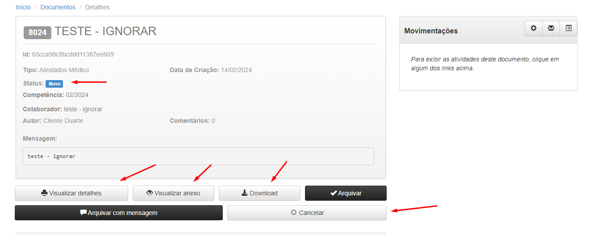

6 - Tambem é possivel consultar os cadastros realizados no "Escritório Virtual", basta seleciona-lo e fazer os mesmos processos para consultar

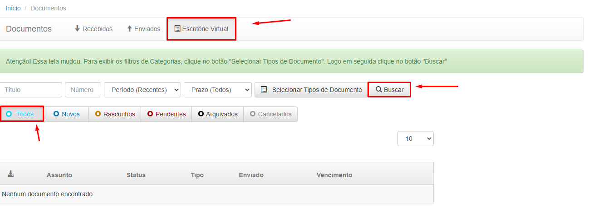

## Visualizando Documentos Recebidos

1 - Para visualizar os documentos que enviamos para você, clique em "Meus Documentos"

2 - Nessa etapa é necessario colocar os filtros para visualizar os documentos.

* Deixe a opção "Recebidos" selecionada

* Selecione a opção "Todos" 

* Clique em "Buscar"

3 - Fazendo esses passos todas as suas publicações recebidas (ja visualizadas e em aberto) serão listadas.

**Explicação dos status de documentos**

* NOVO: Publicação que você ainda precisa visualizar

* PENDENTE: Publicação que foi aberta, porem não fez download dos Arquivos

* ARQUIVADO: Publicação que ja foi aberta e ja foi feito o download dos arquivos

 4 - Para visualizar o documento clique na "Lupinha" na frente da publicação desejada.

 

 5 - Nessa tela é possivel ver algumas informações da publicação e para fazer o download dos arquivos cliquem em "Download" e assim os arquivos serão baixados no seu computador.

 

 * *Após fazer isso o status da publicação irá automaticamente para "Arquivado"*

 5.1 - Ainda na tela da publicação, temos a opção de visualizar o historico da publicação. Quem enviou, quem visualizou, quem recebeu a publicação, tudo isso com dia e horario que a atividade foi realizada. Para visualizar, clique na "Engrenagem ao lado de "Movimentações".

* *Após clicar poderá ver todas as movimentações*

6 - Não se esqueça de sempre abrir os documentos que você fez download e verificar sobre o que se trata.